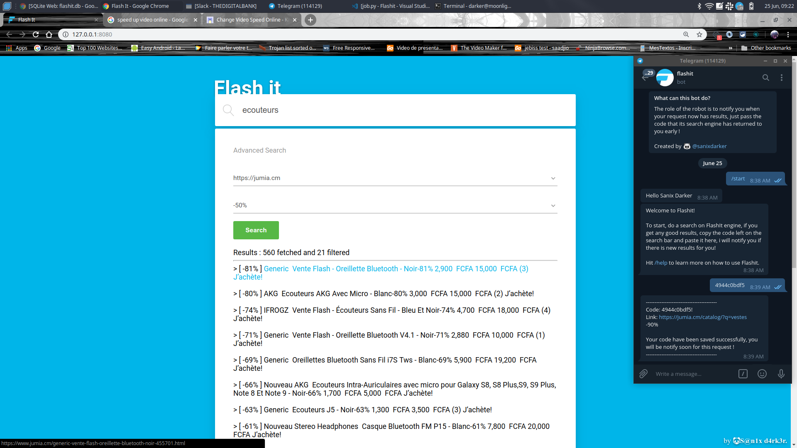

# Flashit

A nice system to be notify when there is soldes on products.

# IMPORTANT NOTE:

- This source code is only for Educational purpose, am not responsible of the bas use of this code.
- This project is not yet running Online!

# DEMO:

- See a full test on [Youtube](https://www.youtube.com/watch?v=PrbXV9MFuto)


# Features:

- A search engine.
- A chat bot.
- A background Job that fetch your requests.

# How to deploy

```shell
# Install requirements
pip install -r requirements.txt

# Create your telegram Bot and it's API

# Start the api in a new tab
python ./api/main.py

# Start the job in a new tab
python ./bot/job.py

# Configure your Config file
# Rename config.example by config.txt

# Start the Telegram Bot in a new tab
python ./bot/main.py

# Now open the html file for the IHM view available here: ./web/index.html

# annnndd that's all... i gues! Create anissue if you need more answer!

```

# Rendering:



# Author

- Sanix darker

# MIT LICENSE

